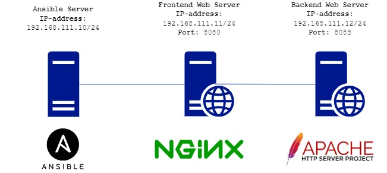

# Otus Homework 2. Ansible

### Цель домашнего задания
Написать первые шаги с Ansible.
### Описание домашнего задания
Подготовить стенд на Vagrant как минимум с одним сервером. На этом сервере, используя Ansible необходимо развернуть nginx со следующими условиями:
- необходимо использовать модуль yum/apt
- конфигурационный файлы должны быть взяты из шаблона jinja2 с переменными
- после установки nginx должен быть в режиме enabled в systemd
- должен быть использован notify для старта nginx после установки
- сайт должен слушать на нестандартном порту - 8080, для этого использовать переменные в Ansible
- cделать все это с использованием Ansible роли

## Выполнение

С помощью **Vagrant** собран стенд из двух виртуальных машин: **nginx** в качестве frontend сервера и **apache** backend сервер. **Ansible** установлен на соседней виртуальной машине, находящейся в одной частной сети с веб серверами.  
В результате выполнения *Playbook* **nginx** будет принимать запросы по *8080* порту и передавать их на *8088* порт **Apache**.

Боксы были скачены из Vagrant Cloud, соотвественно выполнение команды **vagrant up** должно осуществляться при ***подключенном VPN-соединении***.

  

Так как **Ansible** запускается не с хоста, на котором установлен **Vagrant**, в **Vagrantfile** добавлен скрипт, копирующий SSH ключ на созданные ВМ.

Ansible playbook запускается с ипользованием ролей: *nginx-frontend* и *apache-backend*
### nginx-frontend
- выполняется установка nginx с помощью модуля apt
- с помощью handler перезапускается и добавляется в авгозагрузку служба nginx
- копируется файлы конфигурации nginx, сгенерированные из jinja шаблонов
- с помощью handler перезагружаются файлы конфигурации nginx
### apache-backend
- выполняется установка apache с помощью модуля apt
- с помощью handler перезапускается и добавляется в авгозагрузку служба apache2
- копируется файлы конфигурации apache, сгенерированные из jinja шаблонов
- с помощью handler перезагружаются файлы конфигурации apache
